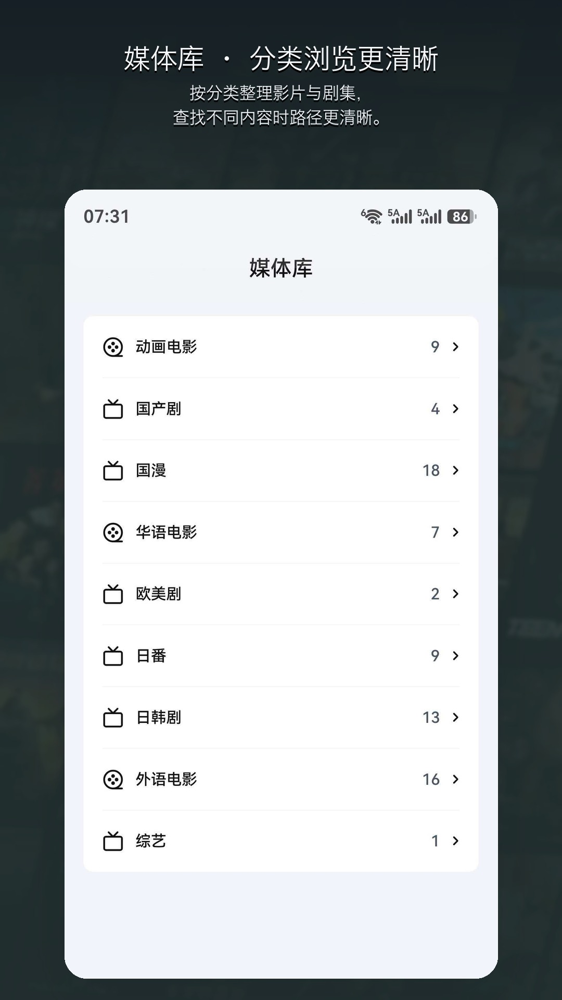

<h1 align="center">MaFei for HarmonyOS</h1>
<h3 align="center">HarmonyOS implementation of the MaFei Jellyfin third-party client</h3>

---

 
 

`ohosApp` 是 `MaFei` 仓库中的 HarmonyOS 客户端工程，用于连接 Jellyfin 服务器并在 HarmonyOS 设备上完成媒体浏览、剧集选播和双引擎播放。

## 项目关系

- 当前仓库：`MaFei`
  https://github.com/chashaochang/MaFei
- 早期独立 HarmonyOS 项目：`JellyFin_HarmonyOS`
  https://github.com/chashaochang/JellyFin_HarmonyOS

`ohosApp` 的实现是基于早期 `JellyFin_HarmonyOS` 项目持续演进而来，当前已经并入 `MaFei` 仓库，作为 `MaFei 1.x` 阶段的 HarmonyOS 客户端实现继续维护。

在界面风格上，由于作者本身是 NAS 爱好者，也是飞牛的用户，当前版本在部分布局和视觉处理上参考了飞牛的产品设计思路。

## 下载

- 华为应用市场  
  https://appgallery.huawei.com/app/detail?id=cn.xiaobai.mafei

## 已实现

### 连接与账号

- Jellyfin 服务器连接
- 服务器切换
- 局域网设备发现
- 登录与基础账号状态管理

### 媒体浏览

- 首页内容展示
- 收藏页
- 媒体库浏览
- 搜索
- 视频详情页
- 选季选集
- 视频信息展示

### 播放能力

- 系统 `AVPlayer` 与 `mpv` 双引擎播放
- 直播播放
- 播放进度记录与续播
- 下一集
- 长按三倍速与常规倍速
- 音量、亮度、进度手势控制
- 全屏锁
- 横竖屏适配
- 平板 / PC 形态适配中

### 字幕、音轨与清晰度

- `ass / srt` 字幕支持
- 默认音轨 / 默认字幕选择
- 音轨切换
- 字幕切换
- 清晰度切换

### 系统集成

- 通知栏播放卡片（AVSession）
- 投屏（AVCast）

### 特殊场景

- 小雅 Jellyfin 基础支持

## 展示图

| 首页 | 详情页 | 媒体库 | 收藏 |
|:---:|:---:|:---:|:---:|
|  |  |  |  |

## 技术说明

- 服务器相关能力基于 Jellyfin 的 <a href="https://github.com/jellyfin/jellyfin-sdk-typescript">TypeScript SDK</a> 做了 HarmonyOS 适配
- 播放器采用系统 `AVPlayer` 与 `mpv` 双引擎方案
- 部分播放控制页实现参考了 <a href="https://gitee.com/openharmony-tpc/openharmony_tpc_samples/tree/master/GSYVideoPlayer">GSYVideoPlayer</a>
- 弹窗使用 <a href="https://github.com/xdd666t/ohos_smart_dialog">ohos_smart_dialog</a>

## 鸣谢

- 感谢 `hosplayer` 作者 `5en` 大佬提供 `mpv` 相关源码支持，帮助当前 HarmonyOS 播放能力落地。也欢迎关注他的项目：`hosplayer / mpv`
  https://github.com/dex2oat/mpv
- 感谢 Jellyfin、OpenHarmony 与相关开源项目作者提供的基础能力与参考实现

## 联系方式

- QQ群：991893385
